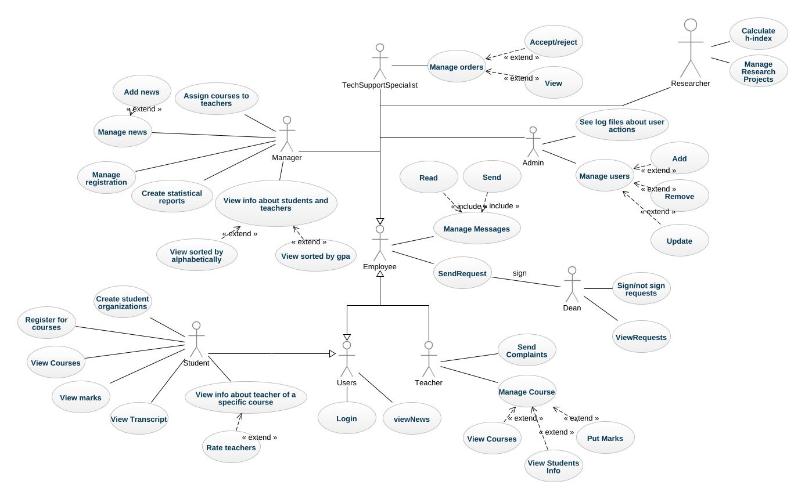
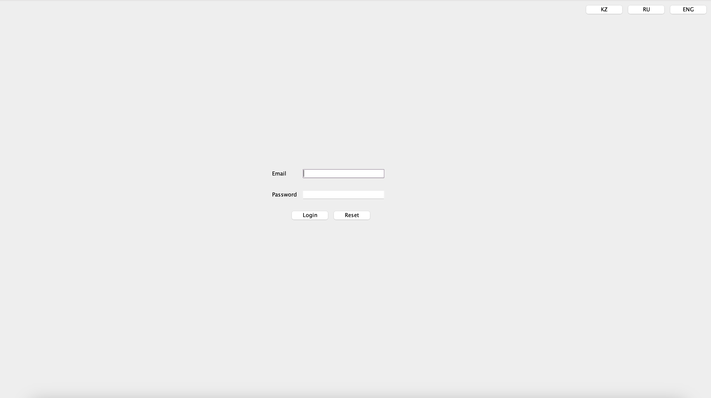
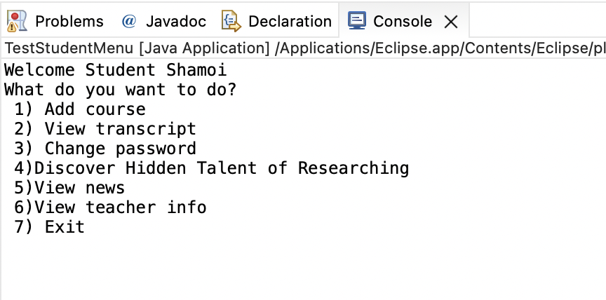

# Object-Oriented Programming Final Project: University Intranet
Welcome to the repository for the Object-Oriented Programming (OOP) final project. This project is about creating an intranet system for all university members, developed in Java using APIs like Java AWT and libraries like Swing. 
## Class diagram

## Use case diagram

## Login page

## Menu of users

## Certificate

